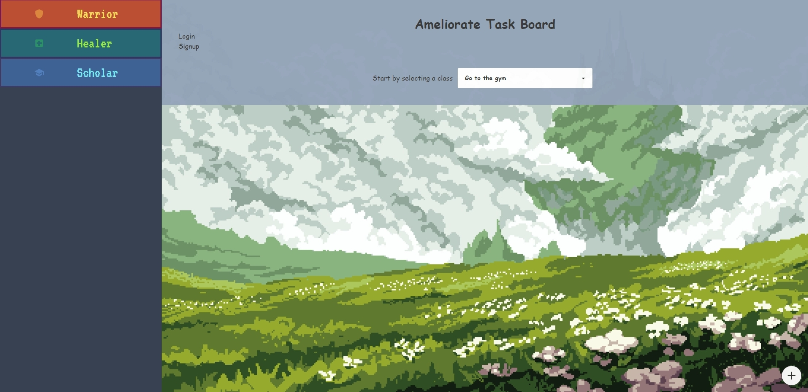
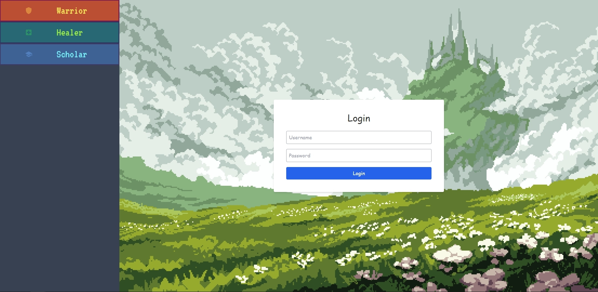
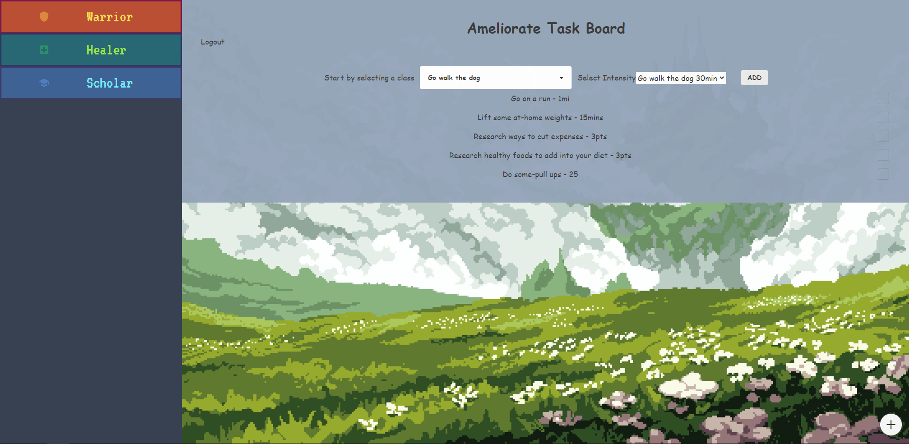

# <Ameliorate>

## Description

Ameliorate can stimulate your day and plan it out so you don’t have to.  Our team shared a growing passion in RPG’s and video games. However we realized that the world we live in doesn’t offer that same structure and motivating factors that video games do. We knew that if we could spice up the lives of our users and utilize rewards to keep them on track, we would then be able to inspire them to accomplish and power through their tasks.  Our nifty game-like to-do planner helps the user gain the diligence to complete mundane chores with the end benefit of small rewards.

## Table of Contents 

If your README is long, add a table of contents to make it easy for users to find what they need.

- [Installation](#installation)
- [Usage](#usage)
- [Credits](#credits)
- [License](#license)

## Installation

- [ameliorate.herokuapp.com/](https://ameliorate.herokuapp.com/)

## Usage

A user will arrive at the site and be prompted to create a profile. After loging in, the user will be able to add tasks to their TO-Do list. In order to add a task the user will have to select a class, the classes are categories that the pregenerated tasks have been sorted into. then using the drop down menu a user can select the task they want. They will then be asked what difficulty level they want for that task. then the task is added. After that point, a user will go throughout their day and when they complete a task they will log in and check off that they completed the task and be rewarded with the points associated with that task and difficulty. 

## Credits

-Francisco Perez Perez (https://github.com/Viruz0322)

-Nathan Nguyen (https://github.com/Viruz0322)

-Armaan Zabihi (https://github.com/ArmaanZabihi)

-Kaz Nyborg-Andersen (https://github.com/kaznyborg)

## License

MIT License

Copyright (c) [2023] [Francisco Perez Perez, Nathan Nguyen, Armaan Zabihi, Kaz Nyborg-Andersen]

Permission is hereby granted, free of charge, to any person obtaining a copy
of this software and associated documentation files (the "Software"), to deal
in the Software without restriction, including without limitation the rights
to use, copy, modify, merge, publish, distribute, sublicense, and/or sell
copies of the Software, and to permit persons to whom the Software is
furnished to do so, subject to the following conditions:

The above copyright notice and this permission notice shall be included in all
copies or substantial portions of the Software.

THE SOFTWARE IS PROVIDED "AS IS", WITHOUT WARRANTY OF ANY KIND, EXPRESS OR
IMPLIED, INCLUDING BUT NOT LIMITED TO THE WARRANTIES OF MERCHANTABILITY,
FITNESS FOR A PARTICULAR PURPOSE AND NONINFRINGEMENT. IN NO EVENT SHALL THE
AUTHORS OR COPYRIGHT HOLDERS BE LIABLE FOR ANY CLAIM, DAMAGES OR OTHER
LIABILITY, WHETHER IN AN ACTION OF CONTRACT, TORT OR OTHERWISE, ARISING FROM,
OUT OF OR IN CONNECTION WITH THE SOFTWARE OR THE USE OR OTHER DEALINGS IN THE
SOFTWARE.
